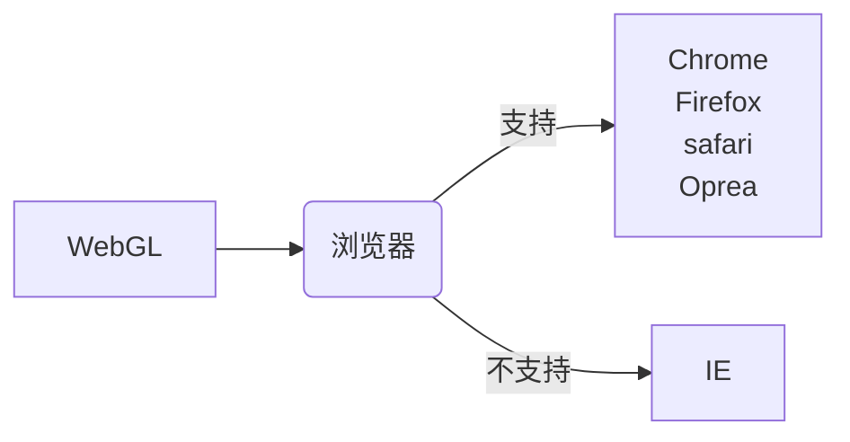

# WebGL

####  三维图形学的基本概念

​		着色器

​		渲染管线

​		模型变换

​		投影矩阵

#### WebGL能干什么？

##### 面向人群

```text
	1. 希望在网页中加入三维图形的Web开发者
	2. 希望将三维图形搬上网页环境的三维图形开发者
```

##### 针对事件

```text
	1. 如何向网页中或者Web程序中插入三维图形？
	
	   WebGL会提供强大的解决方案，你可以使用三维图形来增强Web程序的用户界面(UI)，或者开发更复		杂的三维程序，比如运行在浏览器中的三维网页游戏
       
	2. 你希望了解如何在网页环境中应用  Direct3D 或 OpenGL 这些知识？
	
   	   你一定对开发出能够在现代浏览器中运行的复杂三维程序更感兴趣
```

##### 针对WebGL版本1.0 （能学到什么?)

```text
	1. WebGL、HTML、JavaScript是如何联系
	2. 如何建立和运行WebGL程序
	3. 如何使用JavaScript控制复杂的三维“着色器”程序
```

#####  详细讲解

```text
	1. 如何编写顶点着色器和片元着色器
	2. 如何使用该机的渲染技术
	3. 顶点光照、阴影、基本的交互操作（如选中三维物体）
```

### 总结笔记结构

##### 第一章——WebGL概述

##### 第二章——WebGL入门

##### 第三章——绘制和变换三角形

##### 第四章——高级变换和动画基础

##### 第五章——颜色和纹理

##### 第六章——OpenGL ES着色器语言（GLSL ES）

##### 第七章——进入三维世界

##### 第八章——光照

##### 第九章——层次模型

##### 第十章——高级技术

##### 附录 A——WebGL 无须交换缓冲区

##### 附录 B——GLSL ES1.0 内置函数

##### 附录 C——投影矩阵

##### 附录 D——WebGL / OpenGL ： 左手还是右手坐标系？

##### 附录 E——逆转值矩阵

##### 附录 F——从文件中加载着色器

##### 附录 G——世界坐标系和本地坐标系

##### 附录 H——关于WebGL的浏览器设置


### 支持WebGL的浏览器



##### 最低支持环境

| 浏览器 | 操作系统 | 居中对齐 |
| :----: | :----: | :----: |
| Chrome | Windows7 & 8 及以上 | NVIDA Quadro FX 380 <br/> NVDIA GTX 580 <br/> NVDIV GeForce GTS 450 <br/> Mobile Intel 4 Series Express Chipset Family <br/> AMD Radeon HD 6970 <br/> 及以上版本|

##### 如果遇到硬件方面原因：

www.khronos.org/webgl/wiki/BlacklistsAndWhitelists

##### 本书的支持网站：

https://sites.google.com/site/webglbook/

##### 作者的站点：

https://sites.google.com/site/webglbook

